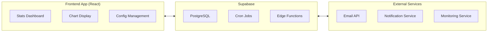

# Xiandan Kanban Board Application - Email Reminders and Statistics System Design

## 1. System Overview

Xiandan Kanban board application's email reminders and statistics system aims to improve team collaboration efficiency and project management quality through automated email notifications and data analysis. The system will be built based on the Supabase platform, combining Cron Jobs scheduled tasks, email service integration, and data visualization components.

### 1.1 Core Functions
- Automated email reminders (task due dates, status changes, priority reminders)
- Regular statistical report generation
- Real-time data dashboard display
- Team performance analysis
- System health monitoring

### 1.2 Technical Architecture


## 2. Scheduled Task Implementation Plan (Supabase Cron Jobs)

### 2.1 Scheduled Task Strategy

#### 2.1.1 Task Reminder Timers
```sql
-- Daily task due reminders (weekdays at 9:00 AM)
0 9 * * 1-5

-- Weekly team review reports (every Friday at 5:00 PM)
0 17 * * 5

-- Monthly project summary reports (last day of month at 11:00 PM)
0 23 L * *
```

#### 2.1.2 Data Statistics Timers
```sql
-- Real-time statistics updates (hourly)
0 * * * *

-- Daily data analysis (2:00 AM)
0 2 * * *

-- Weekly deep analysis (Sunday night at 10:00 PM)
0 22 * * 0
```

### 2.2 Cron Jobs Configuration Implementation

#### 2.2.1 Create Scheduled Task Edge Function
```typescript
// supabase/functions/scheduled-tasks/index.ts
import { serve } from "https://deno.land/std@0.168.0/http/server.ts"
import { createClient } from 'https://esm.sh/@supabase/supabase-js@2'

serve(async (req) => {
  const corsHeaders = {
    'Access-Control-Allow-Origin': '*',
    'Access-Control-Allow-Headers': 'authorization, x-client-info, apikey, content-type',
    'Access-Control-Allow-Methods': 'POST, GET, OPTIONS',
  }

  if (req.method === 'OPTIONS') {
    return new Response(null, { headers: corsHeaders })
  }

  try {
    const { task_type } = await req.json()
    const supabase = createClient(
      Deno.env.get('SUPABASE_URL')!,
      Deno.env.get('SUPABASE_SERVICE_ROLE_KEY')!
    )

    switch (task_type) {
      case 'daily_reminder':
        await sendDailyReminders(supabase)
        break
      case 'weekly_report':
        await generateWeeklyReport(supabase)
        break
      case 'monthly_summary':
        await generateMonthlySummary(supabase)
        break
      case 'hourly_stats':
        await updateHourlyStats(supabase)
        break
      default:
        throw new Error(`Unknown task type: ${task_type}`)
    }

    return new Response(
      JSON.stringify({ success: true, task_type }),
      { headers: { ...corsHeaders, 'Content-Type': 'application/json' } }
    )
  } catch (error) {
    return new Response(
      JSON.stringify({ error: error.message }),
      { status: 500, headers: { ...corsHeaders, 'Content-Type': 'application/json' } }
    )
  }
})

async function sendDailyReminders(supabase: any) {
  // Get today's due tasks
  const { data: tasks } = await supabase
    .from('tasks')
    .select(`
      id, title, description, due_date, status, priority,
      user:profiles!tasks_assignee_id_fkey(name, email),
      project:projects(name)
    `)
    .eq('due_date', new Date().toISOString().split('T')[0])
    .neq('status', 'completed')

  // Send reminder emails
  for (const task of tasks) {
    await sendTaskReminderEmail(task)
  }
}
```

#### 2.2.2 Register Cron Jobs
```sql
-- Daily task reminders
SELECT cron.schedule(
  'daily-task-reminders',
  '0 9 * * 1-5',
  'SELECT net.http_post(
    url := ''https://your-project.supabase.co/functions/v1/scheduled-tasks'',
    headers := ''{"Content-Type": "application/json", "Authorization": "Bearer YOUR_ANON_KEY"}''::jsonb,
    body := ''{"task_type": "daily_reminder"}''::jsonb
  );'
);

-- Weekly reports
SELECT cron.schedule(
  'weekly-reports',
  '0 17 * * 5',
  'SELECT net.http_post(
    url := ''https://your-project.supabase.co/functions/v1/scheduled-tasks'',
    headers := ''{"Content-Type": "application/json", "Authorization": "Bearer YOUR_ANON_KEY"}''::jsonb,
    body := ''{"task_type": "weekly_report"}''::jsonb
  );'
);

-- Monthly summaries
SELECT cron.schedule(
  'monthly-summaries',
  '0 23 L * *',
  'SELECT net.http_post(
    url := ''https://your-project.supabase.co/functions/v1/scheduled-tasks'',
    headers := ''{"Content-Type": "application/json", "Authorization": "Bearer YOUR_ANON_KEY"}''::jsonb,
    body := ''{"task_type": "monthly_summary"}''::jsonb
  );'
);

-- Hourly statistics
SELECT cron.schedule(
  'hourly-stats',
  '0 * * * *',
  'SELECT net.http_post(
    url := ''https://your-project.supabase.co/functions/v1/scheduled-tasks'',
    headers := ''{"Content-Type": "application/json", "Authorization": "Bearer YOUR_ANON_KEY"}''::jsonb,
    body := ''{"task_type": "hourly_stats"}''::jsonb
  );'
);
```

## 3. Email Sending Process and Template Design

### 3.1 Email Service Integration

#### 3.1.1 Configure Email Service
```typescript
// Email service configuration
interface EmailConfig {
  provider: 'resend' | 'sendgrid' | 'mailgun'
  apiKey: string
  fromEmail: string
  fromName: string
}

// Email template interface
interface EmailTemplate {
  subject: string
  htmlContent: string
  textContent?: string
  variables: Record<string, any>
}
```

#### 3.1.2 Email Sending Service
```typescript
// supabase/functions/send-email/index.ts
import { serve } from "https://deno.land/std@0.168.0/http/server.ts"

serve(async (req) => {
  const corsHeaders = {
    'Access-Control-Allow-Origin': '*',
    'Access-Control-Allow-Headers': 'authorization, x-client-info, apikey, content-type',
    'Access-Control-Allow-Methods': 'POST, GET, OPTIONS',
  }

  if (req.method === 'OPTIONS') {
    return new Response(null, { headers: corsHeaders })
  }

  try {
    const { to, template, data } = await req.json()
    
    const emailService = new EmailService()
    const result = await emailService.sendEmail({
      to,
      subject: template.subject,
      html: renderTemplate(template.htmlContent, data),
      text: template.textContent ? renderTemplate(template.textContent, data) : undefined
    })

    return new Response(
      JSON.stringify({ success: true, messageId: result.messageId }),
      { headers: { ...corsHeaders, 'Content-Type': 'application/json' } }
    )
  } catch (error) {
    return new Response(
      JSON.stringify({ error: error.message }),
      { status: 500, headers: { ...corsHeaders, 'Content-Type': 'application/json' } }
    )
  }
})

class EmailService {
  private apiKey = Deno.env.get('RESEND_API_KEY')!
  
  async sendEmail(params: {
    to: string
    subject: string
    html: string
    text?: string
  }) {
    const response = await fetch('https://api.resend.com/emails', {
      method: 'POST',
      headers: {
        'Authorization': `Bearer ${this.apiKey}`,
        'Content-Type': 'application/json',
      },
      body: JSON.stringify({
        from: 'Xiandan Kanban <noreply@xiankuaiban.com>',
        to: [params.to],
        subject: params.subject,
        html: params.html,
        text: params.text,
      }),
    })

    if (!response.ok) {
      throw new Error(`Email sending failed: ${response.statusText}`)
    }

    return await response.json()
  }
}
```

### 3.2 Email Template Design

#### 3.2.1 Task Reminder Template
```html
<!-- Template: task-reminder.html -->
<!DOCTYPE html>
<html lang="zh-CN">
<head>
    <meta charset="UTF-8">
    <meta name="viewport" content="width=device-width, initial-scale=1.0">
    <title>Task Reminder</title>
    <style>
        .email-container { max-width: 600px; margin: 0 auto; font-family: Arial, sans-serif; }
        .header { background: linear-gradient(135deg, #667eea 0%, #764ba2 100%); color: white; padding: 20px; text-align: center; }
        .content { padding: 20px; background: #f9f9f9; }
        .task-card { background: white; border-radius: 8px; padding: 20px; margin: 10px 0; box-shadow: 0 2px 4px rgba(0,0,0,0.1); }
        .priority-high { border-left: 4px solid #e53e3e; }
        .priority-medium { border-left: 4px solid #ed8936; }
        .priority-low { border-left: 4px solid #38a169; }
        .button { display: inline-block; background: #667eea; color: white; padding: 12px 24px; text-decoration: none; border-radius: 6px; margin-top: 15px; }
        .footer { text-align: center; padding: 20px; color: #666; }
    </style>
</head>
<body>
    <div class="email-container">
        <div class="header">
            <h1>📋 Task Reminder</h1>
            <p>You have tasks that need attention</p>
        </div>
        
        <div class="content">
            <div class="task-card priority-{{task.priority}}">
                <h2>{{task.title}}</h2>
                <p><strong>Project:</strong>{{project.name}}</p>
                <p><strong>Due Date:</strong>{{task.due_date}}</p>
                <p><strong>Priority:</strong>
                    <span class="priority-badge priority-{{task.priority}}">
                        {{#if task.priority === 'high'}}🔴 High{{/if}}
                        {{#if task.priority === 'medium'}}🟡 Medium{{/if}}
                        {{#if task.priority === 'low'}}🟢 Low{{/if}}
                    </span>
                </p>
                {{#if task.description}}
                <p><strong>Description:</strong>{{task.description}}</p>
                {{/if}}
                <a href="{{appUrl}}/tasks/{{task.id}}" class="button">View Details</a>
            </div>
            
            <p>If you have any questions, please contact your team leader.</p>
        </div>
        
        <div class="footer">
            <p>Xiandan Kanban - Making Project Management Simpler</p>
            <p>This email is automatically sent, please do not reply</p>
        </div>
    </div>
</body>
</html>
```

#### 3.2.2 Weekly Report Template
```html
<!-- Template: weekly-report.html -->
<!DOCTYPE html>
<html lang="zh-CN">
<head>
    <meta charset="UTF-8">
    <meta name="viewport" content="width=device-width, initial-scale=1.0">
    <title>Weekly Work Report</title>
    <style>
        .email-container { max-width: 800px; margin: 0 auto; font-family: Arial, sans-serif; }
        .header { background: linear-gradient(135deg, #667eea 0%, #764ba2 100%); color: white; padding: 30px; text-align: center; }
        .stats-grid { display: grid; grid-template-columns: repeat(auto-fit, minmax(200px, 1fr)); gap: 20px; padding: 20px; }
        .stat-card { background: white; border-radius: 12px; padding: 20px; text-align: center; box-shadow: 0 4px 6px rgba(0,0,0,0.1); }
        .stat-number { font-size: 2.5em; font-weight: bold; color: #667eea; }
        .chart-container { background: white; margin: 20px; padding: 20px; border-radius: 12px; box-shadow: 0 4px 6px rgba(0,0,0,0.1); }
    </style>
</head>
<body>
    <div class="email-container">
        <div class="header">
            <h1>📊 Weekly Work Report</h1>
            <p>{{week.start}} - {{week.end}}</p>
        </div>
        
        <div class="stats-grid">
            <div class="stat-card">
                <div class="stat-number">{{stats.totalTasks}}</div>
                <p>Total Tasks</p>
            </div>
            <div class="stat-card">
                <div class="stat-number">{{stats.completedTasks}}</div>
                <p>Completed</p>
            </div>
            <div class="stat-card">
                <div class="stat-number">{{stats.completionRate}}%</div>
                <p>Completion Rate</p>
            </div>
            <div class="stat-card">
                <div class="stat-number">{{stats.teamMembers}}</div>
                <p>Team Members</p>
            </div>
        </div>
        
        <div class="chart-container">
            <h3>Task Status Distribution</h3>
            <div style="height: 300px; display: flex; align-items: end; gap: 20px;">
                {{#each statusData}}
                <div style="flex: 1; text-align: center;">
                    <div style="height: {{percentage}}%; background: {{color}}; border-radius: 8px 8px 0 0;"></div>
                    <p>{{label}}: {{count}}</p>
                </div>
                {{/each}}
            </div>
        </div>
        
        <div class="chart-container">
            <h3>Team Member Performance</h3>
            {{#each memberPerformance}}
            <div style="margin: 15px 0; padding: 10px; border-left: 4px solid #667eea; background: #f8f9fa;">
                <strong>{{name}}</strong>
                <div style="margin-top: 5px;">
                    Completion Rate: {{completionRate}}% | Average Processing Time: {{avgTime}} hours
                </div>
            </div>
            {{/each}}
        </div>
        
        <div class="chart-container">
            <h3>Key Focus for Next Week</h3>
            {{#each upcomingPriorities}}
            <div style="margin: 10px 0; padding: 15px; background: #fff3cd; border: 1px solid #ffeaa7; border-radius: 6px;">
                <strong>{{title}}</strong>
                <p>{{description}}</p>
            </div>
            {{/each}}
        </div>
    </div>
</body>
</html>
```

#### 3.2.3 Template Rendering Function
```typescript
function renderTemplate(template: string, data: Record<string, any>): string {
  let rendered = template
  
  // Simple template replacement
  for (const [key, value] of Object.entries(data)) {
    const placeholder = new RegExp(`{{${key}}}`, 'g')
    rendered = rendered.replace(placeholder, String(value))
  }
  
  // Handlebars-style template support
  rendered = rendered.replace(/{{#if\s+([^}]+)}}([\s\S]*?){{\/if}}/g, (match, condition, content) => {
    // Simple conditional logic
    if (evaluateCondition(condition, data)) {
      return renderTemplate(content, data)
    }
    return ''
  })
  
  return rendered
}

function evaluateCondition(condition: string, data: Record<string, any>): boolean {
  // Simplified conditional evaluation logic
  if (condition.includes('===')) {
    const [left, right] = condition.split('===').map(s => s.trim())
    return String(getNestedValue(left, data)) === String(getNestedValue(right, data))
  }
  return Boolean(getNestedValue(condition, data))
}

function getNestedValue(path: string, data: Record<string, any>): any {
  return path.split('.').reduce((obj, key) => obj?.[key], data)
}
```

## 4. Statistics Calculation Logic

### 4.1 Core Statistical Indicators

#### 4.1.1 Task Statistics Indicators
```sql
-- Task total statistics
CREATE OR REPLACE FUNCTION get_task_statistics(
  p_project_id UUID DEFAULT NULL,
  p_start_date DATE DEFAULT CURRENT_DATE - INTERVAL '7 days',
  p_end_date DATE DEFAULT CURRENT_DATE
) RETURNS JSON AS $$
DECLARE
  v_result JSON;
BEGIN
  SELECT json_build_object(
    'total_tasks', COUNT(*),
    'completed_tasks', COUNT(*) FILTER (WHERE status = 'completed'),
    'in_progress_tasks', COUNT(*) FILTER (WHERE status = 'in_progress'),
    'pending_tasks', COUNT(*) FILTER (WHERE status = 'pending'),
    'overdue_tasks', COUNT(*) FILTER (WHERE due_date < CURRENT_DATE AND status != 'completed'),
    'completion_rate', ROUND(
      COUNT(*) FILTER (WHERE status = 'completed') * 100.0 / NULLIF(COUNT(*), 0), 2
    ),
    'average_completion_time', ROUND(
      AVG(EXTRACT(EPOCH FROM (completed_at - created_at))/3600)::numeric, 2
    ),
    'priority_distribution', json_build_object(
      'high', COUNT(*) FILTER (WHERE priority = 'high'),
      'medium', COUNT(*) FILTER (WHERE priority = 'medium'),
      'low', COUNT(*) FILTER (WHERE priority = 'low')
    ),
    'status_distribution', json_build_object(
      'pending', COUNT(*) FILTER (WHERE status = 'pending'),
      'in_progress', COUNT(*) FILTER (WHERE status = 'in_progress'),
      'completed', COUNT(*) FILTER (WHERE status = 'completed'),
      'cancelled', COUNT(*) FILTER (WHERE status = 'cancelled')
    )
  ) INTO v_result
  FROM tasks
  WHERE (p_project_id IS NULL OR project_id = p_project_id)
    AND created_at >= p_start_date
    AND created_at <= p_end_date;
  
  RETURN v_result;
END;
$$ LANGUAGE plpgsql;
```

#### 4.1.2 Team Performance Statistics
```sql
-- Team member performance analysis
CREATE OR REPLACE FUNCTION get_team_performance(
  p_project_id UUID DEFAULT NULL,
  p_start_date DATE DEFAULT CURRENT_DATE - INTERVAL '7 days',
  p_end_date DATE DEFAULT CURRENT_DATE
) RETURNS JSON AS $$
DECLARE
  v_result JSON;
BEGIN
  WITH member_stats AS (
    SELECT 
      p.id,
      p.name,
      p.email,
      COUNT(t.id) as total_tasks,
      COUNT(t.id) FILTER (WHERE t.status = 'completed') as completed_tasks,
      COUNT(t.id) FILTER (WHERE t.due_date < CURRENT_DATE AND t.status != 'completed') as overdue_tasks,
      ROUND(
        COUNT(t.id) FILTER (WHERE t.status = 'completed') * 100.0 / 
        NULLIF(COUNT(t.id), 0), 2
      ) as completion_rate,
      AVG(EXTRACT(EPOCH FROM (t.completed_at - t.created_at))/3600) as avg_completion_hours,
      COUNT(t.id) FILTER (WHERE t.priority = 'high') as high_priority_tasks
    FROM profiles p
    LEFT JOIN tasks t ON t.assignee_id = p.id
      AND (p_project_id IS NULL OR t.project_id = p_project_id)
      AND t.created_at >= p_start_date
      AND t.created_at <= p_end_date
    WHERE p.team_member = true
    GROUP BY p.id, p.name, p.email
  )
  SELECT json_agg(
    json_build_object(
      'member_id', id,
      'name', name,
      'email', email,
      'total_tasks', COALESCE(total_tasks, 0),
      'completed_tasks', COALESCE(completed_tasks, 0),
      'overdue_tasks', COALESCE(overdue_tasks, 0),
      'completion_rate', COALESCE(completion_rate, 0),
      'avg_completion_hours', ROUND(COALESCE(avg_completion_hours, 0), 2),
      'high_priority_tasks', COALESCE(high_priority_tasks, 0)
    )
  ) INTO v_result
  FROM member_stats;
  
  RETURN v_result;
END;
$$ LANGUAGE plpgsql;
```

#### 4.1.3 Project Health Score Analysis
```sql
-- Project health score calculation
CREATE OR REPLACE FUNCTION calculate_project_health_score(
  p_project_id UUID,
  p_period_days INTEGER DEFAULT 30
) RETURNS JSON AS $$
DECLARE
  v_total_tasks INTEGER;
  v_completed_tasks INTEGER;
  v_overdue_tasks INTEGER;
  v_completion_rate NUMERIC;
  v_health_score NUMERIC;
  v_result JSON;
BEGIN
  -- Get basic statistics
  SELECT 
    COUNT(*),
    COUNT(*) FILTER (WHERE status = 'completed'),
    COUNT(*) FILTER (WHERE due_date < CURRENT_DATE AND status != 'completed'),
    ROUND(COUNT(*) FILTER (WHERE status = 'completed') * 100.0 / NULLIF(COUNT(*), 0), 2)
  INTO v_total_tasks, v_completed_tasks, v_overdue_tasks, v_completion_rate
  FROM tasks
  WHERE project_id = p_project_id
    AND created_at >= CURRENT_DATE - INTERVAL '1 day' * p_period_days;
  
  -- Calculate health score
  v_health_score := 0;
  
  -- Completion rate score (0-40 points)
  IF v_completion_rate >= 90 THEN
    v_health_score := v_health_score + 40;
  ELSIF v_completion_rate >= 80 THEN
    v_health_score := v_health_score + 35;
  ELSIF v_completion_rate >= 70 THEN
    v_health_score := v_health_score + 30;
  ELSIF v_completion_rate >= 60 THEN
    v_health_score := v_health_score + 20;
  ELSE
    v_health_score := v_health_score + 10;
  END IF;
  
  -- Overdue rate score (0-30 points)
  IF v_total_tasks > 0 THEN
    DECLARE
      v_overdue_rate NUMERIC := (v_overdue_tasks * 100.0 / v_total_tasks);
    BEGIN
      IF v_overdue_rate <= 10 THEN
        v_health_score := v_health_score + 30;
      ELSIF v_overdue_rate <= 20 THEN
        v_health_score := v_health_score + 25;
      ELSIF v_overdue_rate <= 30 THEN
        v_health_score := v_health_score + 20;
      ELSIF v_overdue_rate <= 50 THEN
        v_health_score := v_health_score + 10;
      END IF;
    END;
  ELSE
    v_health_score := v_health_score + 30; -- Full score when no tasks
  END IF;
  
  -- Activity score (0-30 points)
  DECLARE
    v_active_days INTEGER;
  BEGIN
    SELECT COUNT(DISTINCT DATE(created_at)) INTO v_active_days
    FROM tasks
    WHERE project_id = p_project_id
      AND created_at >= CURRENT_DATE - INTERVAL '1 day' * p_period_days;
    
    -- Score based on active days
    IF v_active_days >= p_period_days * 0.8 THEN
      v_health_score := v_health_score + 30;
    ELSIF v_active_days >= p_period_days * 0.6 THEN
      v_health_score := v_health_score + 25;
    ELSIF v_active_days >= p_period_days * 0.4 THEN
      v_health_score := v_health_score + 20;
    ELSIF v_active_days >= p_period_days * 0.2 THEN
      v_health_score := v_health_score + 10;
    END IF;
  END;
  
  SELECT json_build_object(
    'project_id', p_project_id,
    'total_tasks', COALESCE(v_total_tasks, 0),
    'completed_tasks', COALESCE(v_completed_tasks, 0),
    'overdue_tasks', COALESCE(v_overdue_tasks, 0),
    'completion_rate', COALESCE(v_completion_rate, 0),
    'health_score', ROUND(v_health_score, 1),
    'health_level', CASE 
      WHEN v_health_score >= 90 THEN 'Excellent'
      WHEN v_health_score >= 75 THEN 'Good'
      WHEN v_health_score >= 60 THEN 'Average'
      ELSE 'Needs Improvement'
    END,
    'recommendations', build_recommendations(v_overdue_tasks, v_completion_rate)
  ) INTO v_result;
  
  RETURN v_result;
END;
$$ LANGUAGE plpgsql;

-- Generate improvement recommendations
CREATE OR REPLACE FUNCTION build_recommendations(
  p_overdue_tasks INTEGER,
  p_completion_rate NUMERIC
) RETURNS JSON AS $$
DECLARE
  v_recommendations TEXT[] := '{}';
BEGIN
  -- Recommendations based on overdue tasks
  IF p_overdue_tasks > 5 THEN
    v_recommendations := array_append(v_recommendations, 'Recommend prioritizing overdue tasks and adjusting task allocation strategy');
  END IF;
  
  -- Recommendations based on completion rate
  IF p_completion_rate < 70 THEN
    v_recommendations := array_append(v_recommendations, 'Low completion rate, recommend checking task difficulty and team workload');
  ELSIF p_completion_rate < 85 THEN
    v_recommendations := array_append(v_recommendations, 'Completion rate has room for improvement, recommend optimizing workflow');
  END IF;
  
  -- General recommendations
  v_recommendations := array_append(v_recommendations, 'Recommend regular team retrospectives for continuous improvement');
  
  RETURN array_to_json(v_recommendations);
END;
$$ LANGUAGE plpgsql;
```

### 4.2 Real-time Statistics API

#### 4.2.1 Statistics API Edge Function
```typescript
// supabase/functions/stats-api/index.ts
import { serve } from "https://deno.land/std@0.168.0/http/server.ts"
import { createClient } from 'https://esm.sh/@supabase/supabase-js@2'

serve(async (req) => {
  const corsHeaders = {
    'Access-Control-Allow-Origin': '*',
    'Access-Control-Allow-Headers': 'authorization, x-client-info, apikey, content-type',
    'Access-Control-Allow-Methods': 'POST, GET, OPTIONS',
  }

  if (req.method === 'OPTIONS') {
    return new Response(null, { headers: corsHeaders })
  }

  try {
    const url = new URL(req.url)
    const endpoint = url.pathname.split('/').pop()
    const supabase = createClient(
      Deno.env.get('SUPABASE_URL')!,
      Deno.env.get('SUPABASE_SERVICE_ROLE_KEY')!
    )

    let result: any

    switch (endpoint) {
      case 'dashboard':
        result = await getDashboardStats(supabase)
        break
      case 'tasks':
        result = await getTaskStatistics(supabase, url.searchParams)
        break
      case 'team':
        result = await getTeamPerformance(supabase, url.searchParams)
        break
      case 'projects':
        result = await getProjectHealth(supabase, url.searchParams)
        break
      case 'trends':
        result = await getTrendAnalysis(supabase, url.searchParams)
        break
      default:
        throw new Error('Unknown endpoint')
    }

    return new Response(
      JSON.stringify({ data: result }),
      { headers: { ...corsHeaders, 'Content-Type': 'application/json' } }
    )
  } catch (error) {
    return new Response(
      JSON.stringify({ error: error.message }),
      { status: 500, headers: { ...corsHeaders, 'Content-Type': 'application/json' } }
    )
  }
})

async function getDashboardStats(supabase: any) {
  const { data: projects } = await supabase
    .from('projects')
    .select('id, name')
  
  const dashboardData = {
    overview: {
      totalProjects: projects?.length || 0,
      activeProjects: 0,
      totalTasks: 0,
      completedToday: 0,
      overdueTasks: 0
    },
    projects: [],
    trends: {
      taskCompletion: [],
      projectHealth: [],
      teamProductivity: []
    }
  }

  if (projects) {
    for (const project of projects) {
      const { data: stats } = await supabase
        .rpc('get_task_statistics', {
          p_project_id: project.id,
          p_start_date: new Date(Date.now() - 7 * 24 * 60 * 60 * 1000).toISOString().split('T')[0],
          p_end_date: new Date().toISOString().split('T')[0]
        })
      
      if (stats) {
        dashboardData.projects.push({
          id: project.id,
          name: project.name,
          ...stats
        })
      }
    }
  }

  // Calculate overall statistics
  dashboardData.overview.activeProjects = dashboardData.projects.length
  dashboardData.overview.totalTasks = dashboardData.projects.reduce((sum, p) => sum + (p.total_tasks || 0), 0)
  dashboardData.overview.completedToday = dashboardData.projects.reduce((sum, p) => sum + (p.completed_tasks || 0), 0)
  dashboardData.overview.overdueTasks = dashboardData.projects.reduce((sum, p) => sum + (p.overdue_tasks || 0), 0)

  return dashboardData
}
```

## 5. Data Visualization and Chart Display

### 5.1 Frontend Statistics Dashboard Component

#### 5.1.1 Main Dashboard Component
```typescript
// components/StatsDashboard.tsx
import React, { useState, useEffect } from 'react'
import { LineChart, Line, AreaChart, Area, BarChart, Bar, PieChart, Pie, Cell, XAxis, YAxis, CartesianGrid, Tooltip, Legend, ResponsiveContainer } from 'recharts'
import { Card, CardContent, CardDescription, CardHeader, CardTitle } from './ui/card'

interface DashboardData {
  overview: {
    totalProjects: number
    activeProjects: number
    totalTasks: number
    completedToday: number
    overdueTasks: number
  }
  projects: Array<{
    id: string
    name: string
    total_tasks: number
    completed_tasks: number
    completion_rate: number
    overdue_tasks: number
  }>
  trends: {
    taskCompletion: Array<{ date: string; completed: number; created: number }>
    projectHealth: Array<{ name: string; score: number }>
    teamProductivity: Array<{ name: string; tasks: number; efficiency: number }>
  }
}

const StatsDashboard: React.FC = () => {
  const [data, setData] = useState<DashboardData | null>(null)
  const [loading, setLoading] = useState(true)
  const [error, setError] = useState<string | null>(null)

  useEffect(() => {
    fetchDashboardData()
  }, [])

  const fetchDashboardData = async () => {
    try {
      const response = await fetch('/functions/v1/stats-api/dashboard')
      if (!response.ok) throw new Error('Failed to fetch dashboard data')
      
      const result = await response.json()
      setData(result.data)
    } catch (err) {
      setError(err instanceof Error ? err.message : 'Unknown error')
    } finally {
      setLoading(false)
    }
  }

  if (loading) {
    return <div className="flex justify-center items-center h-64">Loading...</div>
  }

  if (error) {
    return <div className="text-red-500">Error: {error}</div>
  }

  if (!data) return null

  const COLORS = ['#667eea', '#764ba2', '#f093fb', '#f5576c', '#4facfe', '#00f2fe']

  return (
    <div className="p-6 space-y-6">
      {/* Overview Cards */}
      <div className="grid grid-cols-1 md:grid-cols-2 lg:grid-cols-5 gap-4">
        <Card>
          <CardHeader className="pb-2">
            <CardTitle className="text-sm font-medium">Total Projects</CardTitle>
          </CardHeader>
          <CardContent>
            <div className="text-2xl font-bold">{data.overview.totalProjects}</div>
          </CardContent>
        </Card>
        
        <Card>
          <CardHeader className="pb-2">
            <CardTitle className="text-sm font-medium">Active Projects</CardTitle>
          </CardHeader>
          <CardContent>
            <div className="text-2xl font-bold text-blue-600">{data.overview.activeProjects}</div>
          </CardContent>
        </Card>
        
        <Card>
          <CardHeader className="pb-2">
            <CardTitle className="text-sm font-medium">Total Tasks</CardTitle>
          </CardHeader>
          <CardContent>
            <div className="text-2xl font-bold text-green-600">{data.overview.totalTasks}</div>
          </CardContent>
        </Card>
        
        <Card>
          <CardHeader className="pb-2">
            <CardTitle className="text-sm font-medium">Completed Today</CardTitle>
          </CardHeader>
          <CardContent>
            <div className="text-2xl font-bold text-emerald-600">{data.overview.completedToday}</div>
          </CardContent>
        </Card>
        
        <Card>
          <CardHeader className="pb-2">
            <CardTitle className="text-sm font-medium">Overdue Tasks</CardTitle>
          </CardHeader>
          <CardContent>
            <div className="text-2xl font-bold text-red-600">{data.overview.overdueTasks}</div>
          </CardContent>
        </Card>
      </div>

      {/* Chart Area */}
      <div className="grid grid-cols-1 lg:grid-cols-2 gap-6">
        {/* Task Completion Trends */}
        <Card>
          <CardHeader>
            <CardTitle>Task Completion Trends</CardTitle>
            <CardDescription>Task creation and completion over the past 7 days</CardDescription>
          </CardHeader>
          <CardContent>
            <ResponsiveContainer width="100%" height={300}>
              <AreaChart data={data.trends.taskCompletion}>
                <CartesianGrid strokeDasharray="3 3" />
                <XAxis dataKey="date" />
                <YAxis />
                <Tooltip />
                <Legend />
                <Area type="monotone" dataKey="created" stackId="1" stroke="#667eea" fill="#667eea" />
                <Area type="monotone" dataKey="completed" stackId="2" stroke="#10b981" fill="#10b981" />
              </AreaChart>
            </ResponsiveContainer>
          </CardContent>
        </Card>

        {/* Project Health */}
        <Card>
          <CardHeader>
            <CardTitle>Project Health</CardTitle>
            <CardDescription>Health scores for each project</CardDescription>
          </CardHeader>
          <CardContent>
            <ResponsiveContainer width="100%" height={300}>
              <BarChart data={data.trends.projectHealth}>
                <CartesianGrid strokeDasharray="3 3" />
                <XAxis dataKey="name" />
                <YAxis domain={[0, 100]} />
                <Tooltip />
                <Bar dataKey="score" fill="#667eea" />
              </BarChart>
            </ResponsiveContainer>
          </CardContent>
        </Card>
      </div>

      {/* Project Details Table */}
      <Card>
        <CardHeader>
          <CardTitle>Project Detailed Statistics</CardTitle>
          <CardDescription>Detailed data statistics for each project</CardDescription>
        </CardHeader>
        <CardContent>
          <div className="overflow-x-auto">
            <table className="w-full">
              <thead>
                <tr className="border-b">
                  <th className="text-left p-2">Project Name</th>
                  <th className="text-center p-2">Total Tasks</th>
                  <th className="text-center p-2">Completed</th>
                  <th className="text-center p-2">Completion Rate</th>
                  <th className="text-center p-2">Overdue Tasks</th>
                  <th className="text-center p-2">Health</th>
                </tr>
              </thead>
              <tbody>
                {data.projects.map((project) => (
                  <tr key={project.id} className="border-b hover:bg-gray-50">
                    <td className="p-2 font-medium">{project.name}</td>
                    <td className="text-center p-2">{project.total_tasks}</td>
                    <td className="text-center p-2">{project.completed_tasks}</td>
                    <td className="text-center p-2">
                      <span className={`px-2 py-1 rounded text-sm ${
                        project.completion_rate >= 80 ? 'bg-green-100 text-green-800' :
                        project.completion_rate >= 60 ? 'bg-yellow-100 text-yellow-800' :
                        'bg-red-100 text-red-800'
                      }`}>
                        {project.completion_rate}%
                      </span>
                    </td>
                    <td className="text-center p-2">
                      {project.overdue_tasks > 0 && (
                        <span className="text-red-600 font-medium">{project.overdue_tasks}</span>
                      )}
                    </td>
                    <td className="text-center p-2">
                      <div className="w-full bg-gray-200 rounded-full h-2">
                        <div 
                          className={`h-2 rounded-full ${
                            project.completion_rate >= 80 ? 'bg-green-500' :
                            project.completion_rate >= 60 ? 'bg-yellow-500' :
                            'bg-red-500'
                          }`}
                        />
                      </div>
                    </td>
                  </tr>
                ))}
              </tbody>
            </table>
          </div>
        </CardContent>
      </Card>
    </div>
  )
}

export default StatsDashboard
```

## 6. System Monitoring and Error Handling

### 6.1 Email Sending Monitoring
- **Delivery Rate Monitoring**: Track email delivery success rates
- **Bounce Rate Analysis**: Monitor hard and soft bounces
- **Open Rate Tracking**: Track email open rates (if supported)
- **Click Rate Analysis**: Monitor link click rates in emails

### 6.2 Error Handling Mechanisms
- **Retry Logic**: Automatic retry for failed email sends
- **Error Classification**: Categorize errors (network, authentication, content)
- **Alert System**: Notify administrators of critical failures
- **Fallback Strategies**: Alternative notification methods when email fails

### 6.3 Performance Metrics
- **Email Queue Monitoring**: Track queue size and processing time
- **API Response Times**: Monitor email service API performance
- **Database Query Performance**: Optimize statistics queries
- **Resource Usage**: Monitor CPU, memory, and network usage

## 7. Configuration Management

### 7.1 Email Template Management
- **Template Versioning**: Track template changes and updates
- **A/B Testing**: Test different template variations
- **Personalization**: Dynamic content based on user preferences
- **Multi-language Support**: Templates in different languages

### 7.2 Scheduled Task Configuration
- **Task Scheduling**: Flexible cron expression configuration
- **Task Dependencies**: Handle task execution order
- **Resource Allocation**: Manage system resources for tasks
- **Monitoring and Alerting**: Track task execution status

## 8. Security Considerations

### 8.1 Email Security
- **Sender Authentication**: SPF, DKIM, DMARC configuration
- **Content Security**: Sanitize email content to prevent XSS
- **Rate Limiting**: Prevent email abuse and spam
- **Data Privacy**: Protect user information in emails

### 8.2 API Security
- **Authentication**: Secure API endpoints with proper authentication
- **Authorization**: Implement role-based access control
- **Input Validation**: Validate all user inputs
- **Rate Limiting**: Prevent API abuse

---

**Document Version**: v1.0  
**Creation Date**: 2025-11-29  
**Last Updated**: 2025-11-29  
**Author**: System Architecture Team