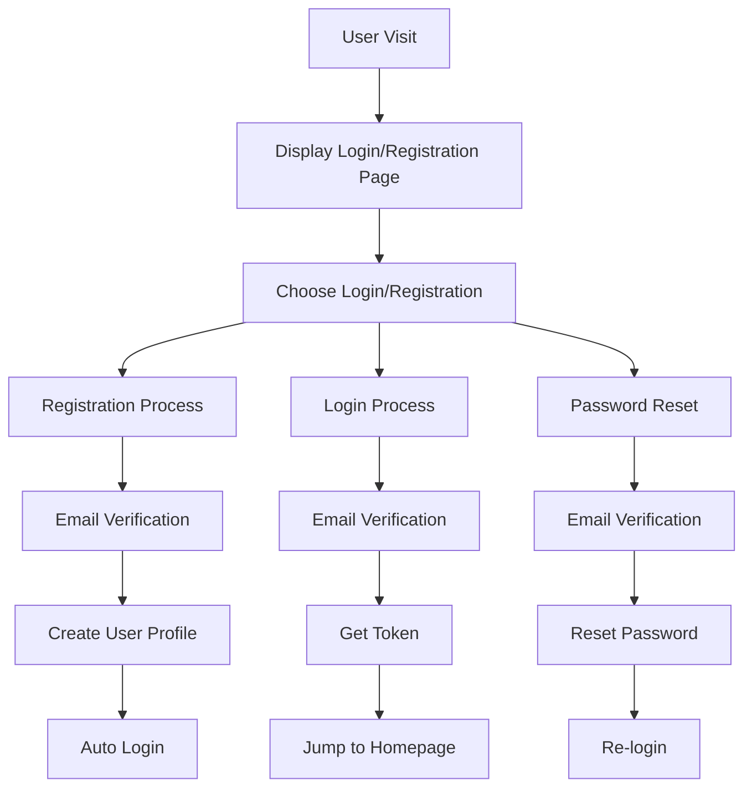
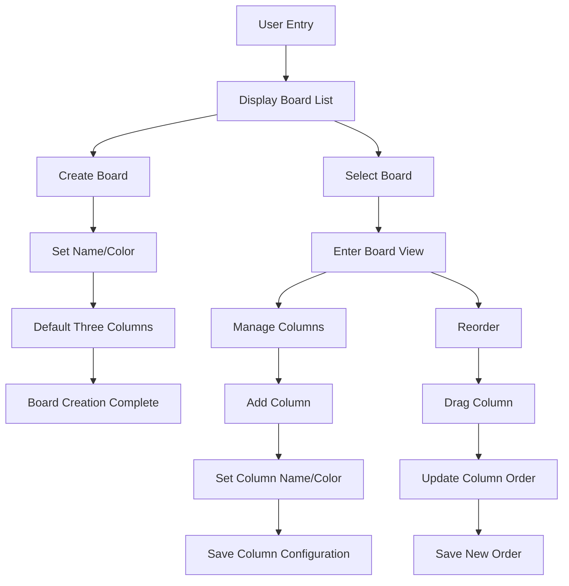
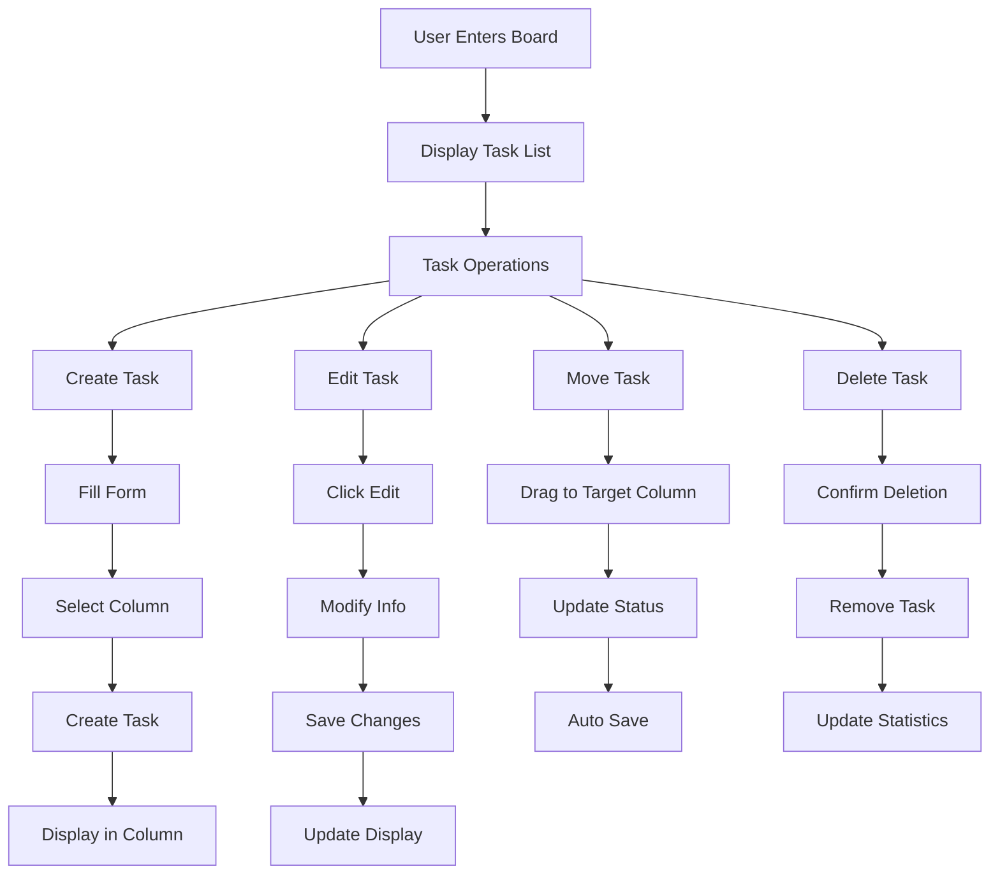
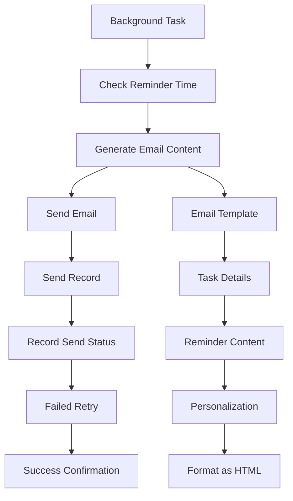
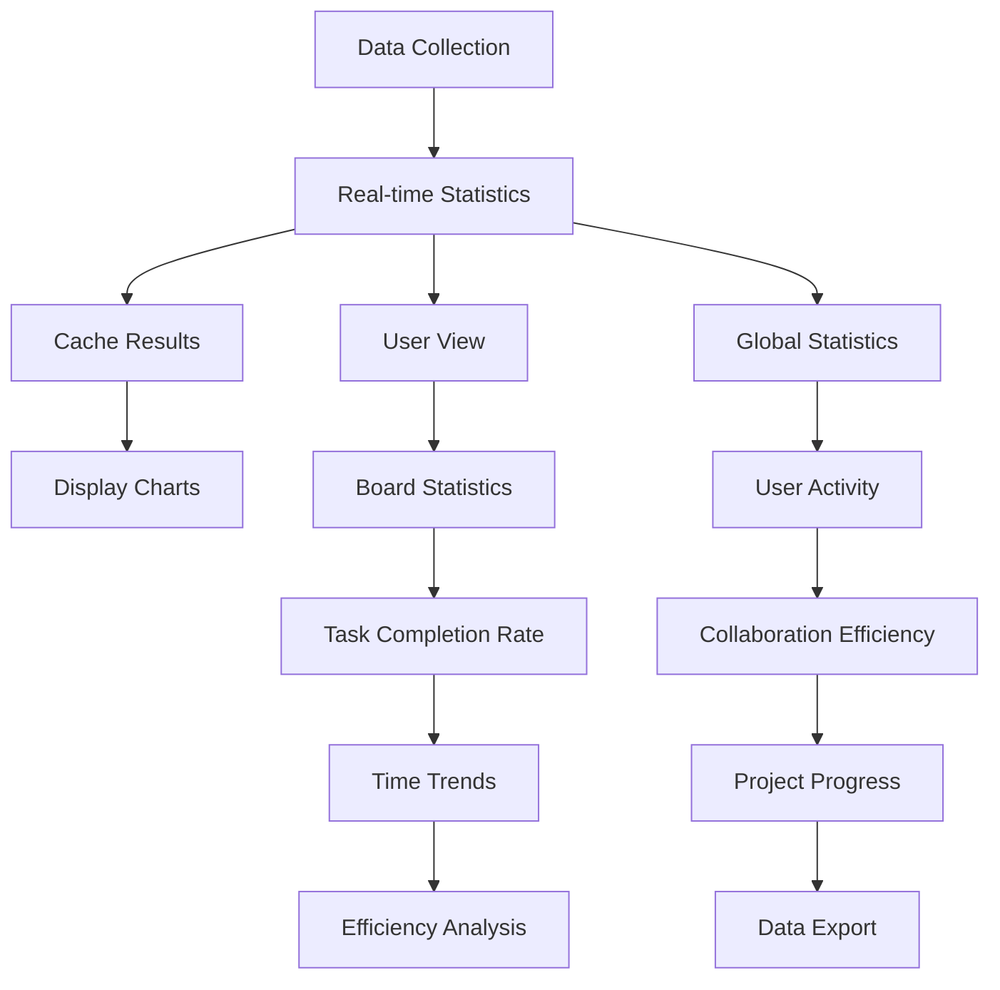

# "Xiandan Kanban" Board Application Feature Requirements Detailed Design

## Table of Contents
1. [Project Overview](#project-overview)
2. [User Authentication System](#user-authentication-system)
3. [Board and Column Management](#board-and-column-management)
4. [Task Management](#task-management)
5. [Email Reminder System](#email-reminder-system)
6. [Statistics Dashboard](#statistics-dashboard)
7. [Technical Implementation Plan](#technical-implementation-plan)
8. [Data Model Design](#data-model-design)

---

## Project Overview

### Product Positioning
"Xiandan Kanban" is a web-based kanban management application that provides intuitive visual task management experience, supporting multi-board management, task drag and drop, email reminders, and other functions.

### Core Value
- Simple and intuitive visual interface
- Flexible task management workflow
- Automated email reminder mechanism
- Rich data statistics functions
- Good user experience

### Technical Architecture
- Frontend: React + TypeScript + Tailwind CSS + DnD Kit
- Backend: Supabase (PostgreSQL + Auth + Edge Functions)
- Deployment: Vercel + Supabase Cloud Services
- Email Service: Supabase Edge Functions + Third-party Email API

---

## 1. User Authentication System

### Feature Description
Based on Supabase's email authentication system, supporting user registration, login, password reset, and other functions.

### Business Process Diagram


### Feature Requirements

#### 1.1 User Registration
- **Trigger Condition**: New user visits the application
- **Input Requirements**: 
  - Email address (required, format validation)
  - Password (required, 8-50 characters, alphanumeric)
  - Confirm password (required, must match password)
- **Business Logic**:
  1. Form validation (email format, password strength)
  2. Call Supabase registration interface
  3. Send email verification link
  4. Wait for user to click verification link
  5. Create default board after successful verification
  6. Auto login and jump to homepage
- **Output Result**: User successfully registered and auto-logged in

#### 1.2 User Login
- **Trigger Condition**: Registered user visits the application
- **Input Requirements**:
  - Email address (required)
  - Password (required)
- **Business Logic**:
  1. Form validation
  2. Call Supabase login interface
  3. Get access token and refresh token
  4. Store token in local storage
  5. Jump to homepage
- **Output Result**: Successfully logged in and jumped to application homepage

#### 1.3 Password Reset
- **Trigger Condition**: User clicks "Forgot Password"
- **Input Requirements**: Email address
- **Business Logic**:
  1. Input email address
  2. Call Supabase password reset interface
  3. Send password reset email
  4. Link in email points to reset page
  5. Set new password
- **Output Result**: Password reset successful, can re-login

#### 1.4 User Status Management
- **Functions**: 
  - Auto token refresh
  - Login status persistence
  - Logout and token cleanup
- **Implementation Plan**: 
  - Use React Context + useAuth Hook
  - Auto detect token expiration and refresh
  - Local storage of token and user information

### Data Model
```sql
-- User Information Table (Supabase Auth Extension)
CREATE TABLE user_profiles (
  id UUID REFERENCES auth.users(id) PRIMARY KEY,
  email TEXT NOT NULL,
  full_name TEXT,
  avatar_url TEXT,
  created_at TIMESTAMP WITH TIME ZONE DEFAULT NOW(),
  updated_at TIMESTAMP WITH TIME ZONE DEFAULT NOW()
);

-- User Preference Settings
CREATE TABLE user_preferences (
  id UUID REFERENCES auth.users(id) PRIMARY KEY,
  email_notifications BOOLEAN DEFAULT true,
  theme TEXT DEFAULT 'light',
  timezone TEXT DEFAULT 'Asia/Shanghai',
  created_at TIMESTAMP WITH TIME ZONE DEFAULT NOW(),
  updated_at TIMESTAMP WITH TIME ZONE DEFAULT NOW()
);
```

---

## 2. Board and Column Management

### Feature Description
Support multi-board management, each board contains multiple columns (task status columns), providing drag and drop reordering functionality.

### Business Process Diagram


### Feature Requirements

#### 2.1 Board Management
- **Create Board**
  - Input: Board name, board color, description
  - Business Logic:
    1. Validate board name is not empty
    2. Create board record
    3. Create default three columns (Todo, In Progress, Done)
    4. Assign board permissions to creator
  - Output: New board and its default columns

- **Edit Board**
  - Input: Board name, description, color
  - Business Logic:
    1. Verify modification permissions
    2. Update board information
    3. Sync update cache
  - Output: Updated board information

- **Delete Board**
  - Input: Confirm deletion operation
  - Business Logic:
    1. Check if has permissions
    2. Check if board is empty (no tasks)
    3. Delete board and related data
  - Output: Board deletion successful

- **Board List**
  - Function: Display all user's boards
  - Sorting: By creation time descending
  - Interaction: Click to enter board details

#### 2.2 Column Management
- **Default Column Settings**
  - Auto-create three columns: Todo, In Progress, Done
  - Each column has default color and sorting

- **Add Custom Column**
  - Input: Column name, column color, description
  - Business Logic:
    1. Validate column name uniqueness
    2. Create new column record
    3. Update column sorting
  - Output: New column added to board

- **Edit Column Information**
  - Input: Column name, color, description
  - Business Logic:
    1. Verify permissions
    2. Update column information
    3. Sync to all clients
  - Output: Column information update successful

- **Delete Column**
  - Input: Confirm deletion
  - Business Logic:
    1. Check if column is empty
    2. Confirm deletion operation
    3. Delete column and re-sort
  - Output: Column deletion successful

- **Column Reordering**
  - Function: Adjust column order through drag and drop
  - Implementation: Use DnD Kit for drag and drop sorting
  - Business Logic:
    1. Capture drag event
    2. Calculate target column and position
    3. Update column database
    4. Batch update database
    5. Sync to other clients

### Data Model
```sql
-- Board Table
CREATE TABLE boards (
  id UUID PRIMARY KEY DEFAULT gen_random_uuid(),
  user_id UUID REFERENCES auth.users(id) NOT NULL,
  name TEXT NOT NULL,
  description TEXT,
  color TEXT DEFAULT '#3B82F6',
  created_at TIMESTAMP WITH TIME ZONE DEFAULT NOW(),
  updated_at TIMESTAMP WITH TIME ZONE DEFAULT NOW()
);

-- Column Configuration Table
CREATE TABLE columns (
  id UUID PRIMARY KEY DEFAULT gen_random_uuid(),
  board_id UUID REFERENCES boards(id) ON DELETE CASCADE,
  name TEXT NOT NULL,
  color TEXT DEFAULT '#6B7280',
  description TEXT,
  position INTEGER NOT NULL,
  created_at TIMESTAMP WITH TIME ZONE DEFAULT NOW(),
  updated_at TIMESTAMP WITH TIME ZONE DEFAULT NOW()
);

-- Board Sharing Table (Multi-user Support)
CREATE TABLE board_members (
  id UUID PRIMARY KEY DEFAULT gen_random_uuid(),
  board_id UUID REFERENCES boards(id) ON DELETE CASCADE,
  user_id UUID REFERENCES auth.users(id) ON DELETE CASCADE,
  role TEXT DEFAULT 'member', -- 'owner', 'admin', 'member'
  created_at TIMESTAMP WITH TIME ZONE DEFAULT NOW(),
  UNIQUE(board_id, user_id)
);
```

---

## 3. Task Management

### Feature Description
Complete task CRUD operations, supporting drag and drop movement, task reminder settings, and other core functions.

### Business Process Diagram


### Feature Requirements

#### 3.1 Task Creation
- **Trigger Condition**: Click "Add Task" button
- **Input Requirements**:
  - Task title (required, 1-200 characters)
  - Task description (optional, 1-2000 characters)
  - Priority (Low, Medium, High, Urgent)
  - Due date (optional)
  - Tags (optional, multiple tags)
  - Assigned to (current user or collaboration members)
- **Business Logic**:
  1. Form validation
  2. Create task record
  3. Set initial position (end of column)
  4. Trigger notification (if reminder set)
  5. Update task statistics
- **Output Result**: New task displayed in specified column

#### 3.2 Task Editing
- **Trigger Condition**: Click task card or edit button
- **Editable Fields**: 
  - Title, description, priority, due date
  - Tags, assignee, move to other columns
- **Business Logic**:
  1. Load current task information
  2. Display edit form
  3. Real-time save changes
  4. Update statistics and reminders
- **Output Result**: Task information updated and re-rendered

#### 3.3 Task Movement (Drag and Drop)
- **Function**: Move tasks between different columns through drag and drop
- **Interaction Design**:
  - Drag start: Task card semi-transparent display
  - Drag process: Show drop zones
  - Drag complete: Task moved to new position
- **Business Logic**:
  1. Capture drag start event
  2. Calculate target column and position
  3. Update task column assignment
  4. Recalculate task sorting
  5. Save to database
  6. Sync to other clients
- **Special Case Handling**:
  - Cross-board movement: Create duplicate task
  - Move to deleted column: Move to default column
  - Concurrent movement: Handle conflicts with optimistic locking

#### 3.4 Task Deletion
- **Trigger Condition**: Click delete button and confirm
- **Business Logic**:
  1. Confirm deletion prompt
  2. Soft delete (mark as deleted)
  3. Update related statistics
  4. Cancel related reminders
- **Output Result**: Task removed from interface

#### 3.5 Task Reminder Settings
- **Reminder Types**:
  - Due date reminder
  - Start date reminder
  - Custom time reminder
- **Reminder Settings**:
  - Advance time (15 minutes, 1 hour, 1 day, 1 week)
  - Repeat pattern (one-time, daily, weekly, monthly)
  - Reminder method (email, in-app notification)
- **Business Logic**:
  1. Calculate reminder time point
  2. Create reminder task queue
  3. Regular check and send reminder
  4. Handle repeat reminder logic

### Data Model
```sql
-- Task Table
CREATE TABLE tasks (
  id UUID PRIMARY KEY DEFAULT gen_random_uuid(),
  board_id UUID REFERENCES boards(id) ON DELETE CASCADE,
  column_id UUID REFERENCES columns(id) ON DELETE SET NULL,
  title TEXT NOT NULL,
  description TEXT,
  priority TEXT DEFAULT 'medium', -- 'low', 'medium', 'high', 'urgent'
  due_date TIMESTAMP WITH TIME ZONE,
  start_date TIMESTAMP WITH TIME ZONE,
  assignee_id UUID REFERENCES auth.users(id),
  creator_id UUID REFERENCES auth.users(id),
  position INTEGER NOT NULL DEFAULT 0,
  is_completed BOOLEAN DEFAULT false,
  is_deleted BOOLEAN DEFAULT false,
  created_at TIMESTAMP WITH TIME ZONE DEFAULT NOW(),
  updated_at TIMESTAMP WITH TIME ZONE DEFAULT NOW()
);

-- Task Tags Table
CREATE TABLE task_tags (
  id UUID PRIMARY KEY DEFAULT gen_random_uuid(),
  task_id UUID REFERENCES tasks(id) ON DELETE CASCADE,
  name TEXT NOT NULL,
  color TEXT,
  created_at TIMESTAMP WITH TIME ZONE DEFAULT NOW()
);

-- Reminder Settings Table
CREATE TABLE reminders (
  id UUID PRIMARY KEY DEFAULT gen_random_uuid(),
  task_id UUID REFERENCES tasks(id) ON DELETE CASCADE,
  type TEXT NOT NULL, -- 'due_date', 'start_date', 'custom'
  reminder_time TIMESTAMP WITH TIME ZONE NOT NULL,
  repeat_pattern TEXT, -- 'none', 'daily', 'weekly', 'monthly'
  is_sent BOOLEAN DEFAULT false,
  created_at TIMESTAMP WITH TIME ZONE DEFAULT NOW(),
  sent_at TIMESTAMP WITH TIME ZONE
);

-- Task Activity Log Table
CREATE TABLE task_activities (
  id UUID PRIMARY KEY DEFAULT gen_random_uuid(),
  task_id UUID REFERENCES tasks(id) ON DELETE CASCADE,
  user_id UUID REFERENCES auth.users(id),
  action TEXT NOT NULL, -- 'created', 'updated', 'moved', 'deleted', 'completed'
  old_value JSONB,
  new_value JSONB,
  created_at TIMESTAMP WITH TIME ZONE DEFAULT NOW()
);
```

---

## 4. Email Reminder System

### Feature Description
Automated email reminder system, supporting scheduled sending, templated emails, personalized content.

### Business Process Diagram


### Feature Requirements

#### 4.1 Email Template Management
- **Default Templates**:
  - Due date reminder email
  - Task overdue reminder email
  - Daily task summary email
  - Board activity report email

- **Template Content Structure**:
  ```html
  <!DOCTYPE html>
  <html>
  <head>
      <title>{{email_title}}</title>
      <style>
          /* Email styles */
      </style>
  </head>
  <body>
      <div class="container">
          <h2>{{greeting}}</h2>
          <p>{{user_name}}，Hello!</p>
          
          <div class="content">
              {{email_content}}
          </div>
          
          <div class="footer">
              <p>This email is from Xiandan Kanban Board Application</p>
              <p><a href="{{app_url}}">Open App</a></p>
          </div>
      </div>
  </body>
  </html>
  ```

- **Template Variables**:
  - {{user_name}}: User name
  - {{email_title}}: Email title
  - {{task_title}}: Task title
  - {{due_date}}: Due date
  - {{priority}}: Priority
  - {{board_name}}: Board name
  - {{app_url}}: Application link

#### 4.2 Scheduled Reminder Tasks
- **Task Scheduling Mechanism**:
  - Use Supabase Edge Functions for scheduled tasks
  - Execute reminder check every 15 minutes
  - Database query for upcoming reminders

- **Check Logic**:
  ```sql
  -- Query reminders that need to be sent
  SELECT r.*, t.title, t.description, t.due_date, 
         t.priority, b.name as board_name,
         u.email, u.full_name
  FROM reminders r
  JOIN tasks t ON r.task_id = t.id
  JOIN boards b ON t.board_id = b.id
  JOIN auth.users u ON t.assignee_id = u.id
  WHERE r.is_sent = false 
    AND r.reminder_time <= NOW()
    AND t.is_deleted = false;
  ```

#### 4.3 Email Sending Function
- **Sending Process**:
  1. Generate personalized email content
  2. Call email sending API
  3. Record send status
  4. Handle failed retries

- **Send Status Management**:
  - pending: Pending send
  - sent: Send successful
  - failed: Send failed
  - retried: Retrying

#### 4.4 Personalized Email Content
- **Due Date Reminder**:
  - Task title and description
  - Remaining time (countdown)
  - Priority indicator
  - Quick action links

- **Daily Summary**:
  - Number of tasks completed today
  - Number of pending tasks
  - List of upcoming due tasks
  - Personal efficiency statistics

### Implementation Plan

#### 4.1 Edge Function Implementation
```typescript
// edge-function/email-reminders.ts
import { serve } from "https://deno.land/std@0.168.0/http/server.ts"
import { createClient } from 'https://esm.sh/@supabase/supabase-js@2'

const corsHeaders = {
  'Access-Control-Allow-Origin': '*',
  'Access-Control-Allow-Headers': 'authorization, x-client-info, apikey, content-type',
  'Access-Control-Allow-Methods': 'POST, GET, OPTIONS, PUT, DELETE, PATCH',
}

serve(async (req) => {
  if (req.method === 'OPTIONS') {
    return new Response(null, { headers: corsHeaders })
  }

  try {
    const supabase = createClient(
      Deno.env.get('SUPABASE_URL') ?? '',
      Deno.env.get('SUPABASE_SERVICE_ROLE_KEY') ?? ''
    )

    // Query pending reminders
    const { data: reminders } = await supabase
      .from('reminders')
      .select(`
        *,
        tasks(*),
        tasks:tasks(
          title,
          description,
          due_date,
          priority,
          boards(name),
          assignee:assignee_id(email, full_name)
        )
      `)
      .eq('is_sent', false)
      .lte('reminder_time', new Date().toISOString())

    // Send emails
    for (const reminder of reminders) {
      await sendReminderEmail(reminder)
    }

    return new Response(JSON.stringify({ success: true }), {
      headers: { ...corsHeaders, 'Content-Type': 'application/json' },
    })
  } catch (error) {
    return new Response(JSON.stringify({ error: error.message }), {
      status: 500,
      headers: { ...corsHeaders, 'Content-Type': 'application/json' },
    })
  }
})
```

#### 4.2 Email Sending Service
- Use third-party email services (such as Resend, SendGrid)
- Implement retry mechanism and error handling
- Support HTML and plain text email formats

---

## 5. Statistics Dashboard

### Feature Description
Provide board-level and global data statistics to help users understand work efficiency and task progress.

### Business Process Diagram


### Feature Requirements

#### 5.1 Board-level Statistics
- **Task Statistics**:
  - Total task count
  - Completed task count
  - In-progress task count
  - Not started task count
  - Overdue task count

- **Completion Rate Analysis**:
  - Completion rate by column
  - Completion rate by time dimension
  - Priority completion status
  - Personal task completion rate

- **Time Analysis**:
  - Average task completion time
  - Average task stay time in each column
  - Task creation and completion trend chart
  - Daily/weekly activity heatmap

#### 5.2 Global Statistics
- **User Statistics**:
  - Total registered users
  - Active users (7 days/30 days)
  - User retention rate
  - User registration trend

- **Board Statistics**:
  - Total board count
  - Average boards per user
  - Board usage frequency
  - Most popular board types

- **Task Statistics**:
  - Total platform tasks
  - Task creation trend
  - Task completion trend
  - Task tag statistics

#### 5.3 Chart Display
- **Bar Chart**: Task quantity statistics
- **Line Chart**: Time trend analysis
- **Pie Chart**: Priority distribution
- **Heatmap**: Activity time analysis
- **Gauge**: Completion rate display

#### 5.4 Data Export
- **Export Formats**: CSV, Excel, PDF
- **Export Content**: 
  - Task list
  - Statistics reports
  - Activity logs
- **Export Scope**: By time range, board scope

### Implementation Plan

#### 5.1 Data Aggregation Query
```sql
-- Board task statistics
SELECT 
  c.name as column_name,
  COUNT(t.id) as task_count,
  COUNT(CASE WHEN t.is_completed THEN 1 END) as completed_count,
  AVG(EXTRACT(EPOCH FROM (t.updated_at - t.created_at))/3600) as avg_hours
FROM columns c
LEFT JOIN tasks t ON c.id = t.column_id
WHERE c.board_id = $1
GROUP BY c.id, c.name, c.position
ORDER BY c.position;

-- Time trend statistics
SELECT 
  DATE_TRUNC('day', created_at) as date,
  COUNT(*) as created_tasks,
  COUNT(CASE WHEN is_completed THEN 1 END) as completed_tasks
FROM tasks
WHERE board_id = $1 
  AND created_at >= NOW() - INTERVAL '30 days'
GROUP BY DATE_TRUNC('day', created_at)
ORDER BY date;
```

#### 5.2 Caching Mechanism
- Redis cache for statistics data
- Scheduled cache updates (hourly)
- Real-time data validation and updates

#### 5.3 Real-time Updates
- Use Supabase Realtime to subscribe to data changes
- Real-time update of statistics charts
- WebSocket push update notifications

---

## 6. Technical Implementation Plan

### 6.1 Frontend Technology Stack

#### Core Technologies
- **React 18**: Use functional components and Hooks
- **TypeScript**: Type safety and development experience
- **Vite**: Fast build tool
- **Tailwind CSS**: Atomic CSS framework

#### State Management
```typescript
// Global state management
interface AppState {
  user: User | null;
  currentBoard: Board | null;
  boards: Board[];
  tasks: Task[];
  columns: Column[];
  isLoading: boolean;
  error: string | null;
}

// Context Provider
const AppContext = createContext<AppState | null>(null);

function useAppState() {
  const context = useContext(AppContext);
  if (!context) throw new Error('useAppState must be used within AppProvider');
  return context;
}
```

#### UI Component Libraries
- **@dnd-kit/core**: Drag and drop functionality
- **@dnd-kit/sortable**: Sortable list
- **react-beautiful-dnd**: Alternative drag and drop solution
- **recharts**: Chart components
- **react-hook-form**: Form management
- **date-fns**: Date handling

#### Drag and Drop Implementation
```typescript
import { DndContext, DragEndEvent, DragStartEvent } from '@dnd-kit/core';
import { SortableContext, verticalListSortingStrategy } from '@dnd-kit/sortable';

function KanbanBoard() {
  const [activeTask, setActiveTask] = useState<Task | null>(null);

  const handleDragStart = (event: DragStartEvent) => {
    const taskId = event.active.id as string;
    const task = tasks.find(t => t.id === taskId);
    setActiveTask(task || null);
  };

  const handleDragEnd = (event: DragEndEvent) => {
    const { active, over } = event;
    
    if (!over) return;

    const taskId = active.id as string;
    const targetColumnId = over.id as string;

    // Move task to target column
    moveTask(taskId, targetColumnId);
    setActiveTask(null);
  };

  return (
    <DndContext onDragStart={handleDragStart} onDragEnd={handleDragEnd}>
      <div className="kanban-board">
        {columns.map(column => (
          <SortableContext 
            key={column.id} 
            items={getTasksByColumn(column.id).map(t => t.id)}
            strategy={verticalListSortingStrategy}
          >
            <KanbanColumn column={column} />
          </SortableContext>
        ))}
      </div>
    </DndContext>
  );
}
```

### 6.2 Backend Technology Stack

#### Supabase Services
- **PostgreSQL**: Main database
- **Auth**: User authentication
- **Realtime**: Real-time data synchronization
- **Edge Functions**: Scheduled tasks and email sending
- **Storage**: File storage (avatars, etc.)

#### Database Design
```sql
-- Enable real-time subscriptions
ALTER PUBLICATION supabase_realtime ADD TABLE boards;
ALTER PUBLICATION supabase_realtime ADD TABLE tasks;
ALTER PUBLICATION supabase_realtime ADD TABLE columns;

-- Create indexes to optimize queries
CREATE INDEX idx_tasks_board_id ON tasks(board_id);
CREATE INDEX idx_tasks_column_id ON tasks(column_id);
CREATE INDEX idx_tasks_assignee_id ON tasks(assignee_id);
CREATE INDEX idx_tasks_due_date ON tasks(due_date);
CREATE INDEX idx_reminders_time ON reminders(reminder_time, is_sent);
```

#### RLS (Row Level Security) Policies
```sql
-- Board permission control
CREATE POLICY "Users can view own boards" ON boards
  FOR SELECT USING (auth.uid() = user_id);

CREATE POLICY "Users can create boards" ON boards
  FOR INSERT WITH CHECK (auth.uid() = user_id);

CREATE POLICY "Board members can view boards" ON boards
  FOR SELECT USING (
    EXISTS (
      SELECT 1 FROM board_members 
      WHERE board_id = boards.id AND user_id = auth.uid()
    )
  );
```

### 6.3 Deployment Plan

#### Development Environment
- **Local Development**: Supabase local instance + Vite dev server
- **Code Management**: Git + GitHub
- **Development Tools**: VSCode + related extensions

#### Production Environment
- **Frontend Deployment**: Vercel
- **Backend Services**: Supabase Cloud
- **Domain**: Custom domain configuration
- **CDN**: Vercel automatic CDN

#### CI/CD Process
```yaml
# .github/workflows/deploy.yml
name: Deploy
on:
  push:
    branches: [main]
jobs:
  deploy:
    runs-on: ubuntu-latest
    steps:
      - uses: actions/checkout@v3
      - name: Setup Node.js
        uses: actions/setup-node@v3
        with:
          node-version: '18'
      - name: Install dependencies
        run: npm install
      - name: Build
        run: npm run build
      - name: Deploy to Vercel
        uses: vercel/action@v1
```

### 6.4 Performance Optimization

#### Frontend Optimization
- **Code Splitting**: React.lazy + Suspense
- **Virtual Scrolling**: Performance optimization for large lists
- **Image Lazy Loading**: Reduce initial loading time
- **State Optimization**: Avoid unnecessary re-renders

#### Database Optimization
- **Index Optimization**: Create indexes for query patterns
- **Query Optimization**: Reduce N+1 queries
- **Pagination**: Paginated loading for large data sets
- **Caching**: Redis cache for hot data

#### Real-time Performance
- **WebSocket Connection Pool**: Manage connection count
- **Incremental Updates**: Only update changed data
- **Batch Operations**: Reduce network request frequency

---

## 7. Data Model Design

### 7.1 Complete Database Structure

```sql
-- User Configuration Table
CREATE TABLE user_profiles (
  id UUID REFERENCES auth.users(id) PRIMARY KEY,
  email TEXT NOT NULL UNIQUE,
  full_name TEXT,
  avatar_url TEXT,
  created_at TIMESTAMP WITH TIME ZONE DEFAULT NOW(),
  updated_at TIMESTAMP WITH TIME ZONE DEFAULT NOW()
);

-- Board Table
CREATE TABLE boards (
  id UUID PRIMARY KEY DEFAULT gen_random_uuid(),
  user_id UUID REFERENCES auth.users(id) NOT NULL,
  name TEXT NOT NULL,
  description TEXT,
  color TEXT DEFAULT '#3B82F6',
  created_at TIMESTAMP WITH TIME ZONE DEFAULT NOW(),
  updated_at TIMESTAMP WITH TIME ZONE DEFAULT NOW()
);

-- Board Member Table
CREATE TABLE board_members (
  id UUID PRIMARY KEY DEFAULT gen_random_uuid(),
  board_id UUID REFERENCES boards(id) ON DELETE CASCADE,
  user_id UUID REFERENCES auth.users(id) ON DELETE CASCADE,
  role TEXT DEFAULT 'member', -- 'owner', 'admin', 'member'
  created_at TIMESTAMP WITH TIME ZONE DEFAULT NOW(),
  UNIQUE(board_id, user_id)
);

-- Column Configuration Table
CREATE TABLE columns (
  id UUID PRIMARY KEY DEFAULT gen_random_uuid(),
  board_id UUID REFERENCES boards(id) ON DELETE CASCADE,
  name TEXT NOT NULL,
  color TEXT DEFAULT '#6B7280',
  description TEXT,
  position INTEGER NOT NULL,
  created_at TIMESTAMP WITH TIME ZONE DEFAULT NOW(),
  updated_at TIMESTAMP WITH TIME ZONE DEFAULT NOW()
);

-- Task Table
CREATE TABLE tasks (
  id UUID PRIMARY KEY DEFAULT gen_random_uuid(),
  board_id UUID REFERENCES boards(id) ON DELETE CASCADE,
  column_id UUID REFERENCES columns(id) ON DELETE SET NULL,
  title TEXT NOT NULL,
  description TEXT,
  priority TEXT DEFAULT 'medium', -- 'low', 'medium', 'high', 'urgent'
  due_date TIMESTAMP WITH TIME ZONE,
  start_date TIMESTAMP WITH TIME ZONE,
  assignee_id UUID REFERENCES auth.users(id),
  creator_id UUID REFERENCES auth.users(id),
  position INTEGER NOT NULL DEFAULT 0,
  is_completed BOOLEAN DEFAULT false,
  is_deleted BOOLEAN DEFAULT false,
  created_at TIMESTAMP WITH TIME ZONE DEFAULT NOW(),
  updated_at TIMESTAMP WITH TIME ZONE DEFAULT NOW()
);

-- Task Tags Table
CREATE TABLE task_tags (
  id UUID PRIMARY KEY DEFAULT gen_random_uuid(),
  task_id UUID REFERENCES tasks(id) ON DELETE CASCADE,
  name TEXT NOT NULL,
  color TEXT,
  created_at TIMESTAMP WITH TIME ZONE DEFAULT NOW()
);

-- Reminder Settings Table
CREATE TABLE reminders (
  id UUID PRIMARY KEY DEFAULT gen_random_uuid(),
  task_id UUID REFERENCES tasks(id) ON DELETE CASCADE,
  type TEXT NOT NULL, -- 'due_date', 'start_date', 'custom'
  reminder_time TIMESTAMP WITH TIME ZONE NOT NULL,
  repeat_pattern TEXT, -- 'none', 'daily', 'weekly', 'monthly'
  is_sent BOOLEAN DEFAULT false,
  created_at TIMESTAMP WITH TIME ZONE DEFAULT NOW(),
  sent_at TIMESTAMP WITH TIME ZONE
);

-- Task Activity Log Table
CREATE TABLE task_activities (
  id UUID PRIMARY KEY DEFAULT gen_random_uuid(),
  task_id UUID REFERENCES tasks(id) ON DELETE CASCADE,
  user_id UUID REFERENCES auth.users(id),
  action TEXT NOT NULL, -- 'created', 'updated', 'moved', 'deleted', 'completed'
  old_value JSONB,
  new_value JSONB,
  created_at TIMESTAMP WITH TIME ZONE DEFAULT NOW()
);

-- Email Send Log Table
CREATE TABLE email_logs (
  id UUID PRIMARY KEY DEFAULT gen_random_uuid(),
  recipient_email TEXT NOT NULL,
  subject TEXT NOT NULL,
  template_name TEXT,
  reminder_id UUID REFERENCES reminders(id),
  status TEXT DEFAULT 'pending', -- 'pending', 'sent', 'failed'
  sent_at TIMESTAMP WITH TIME ZONE,
  error_message TEXT,
  created_at TIMESTAMP WITH TIME ZONE DEFAULT NOW()
);

-- Create Indexes
CREATE INDEX idx_boards_user_id ON boards(user_id);
CREATE INDEX idx_board_members_board_id ON board_members(board_id);
CREATE INDEX idx_board_members_user_id ON board_members(user_id);
CREATE INDEX idx_columns_board_id ON columns(board_id);
CREATE INDEX idx_columns_position ON columns(board_id, position);
CREATE INDEX idx_tasks_board_id ON tasks(board_id);
CREATE INDEX idx_tasks_column_id ON tasks(column_id);
CREATE INDEX idx_tasks_assignee_id ON tasks(assignee_id);
CREATE INDEX idx_tasks_creator_id ON tasks(creator_id);
CREATE INDEX idx_tasks_due_date ON tasks(due_date);
CREATE INDEX idx_tasks_completed ON tasks(is_completed, created_at);
CREATE INDEX idx_tasks_position ON tasks(board_id, column_id, position);
CREATE INDEX idx_task_tags_task_id ON task_tags(task_id);
CREATE INDEX idx_reminders_time ON reminders(reminder_time, is_sent);
CREATE INDEX idx_reminders_task_id ON reminders(task_id);
CREATE INDEX idx_task_activities_task_id ON task_activities(task_id);
CREATE INDEX idx_task_activities_user_id ON task_activities(user_id);
CREATE INDEX idx_email_logs_recipient ON email_logs(recipient_email, created_at);
```

---

**Document Version**: v1.0  
**Creation Date**: 2025-11-29  
**Last Updated**: 2025-11-29  
**Author**: Product Development Team